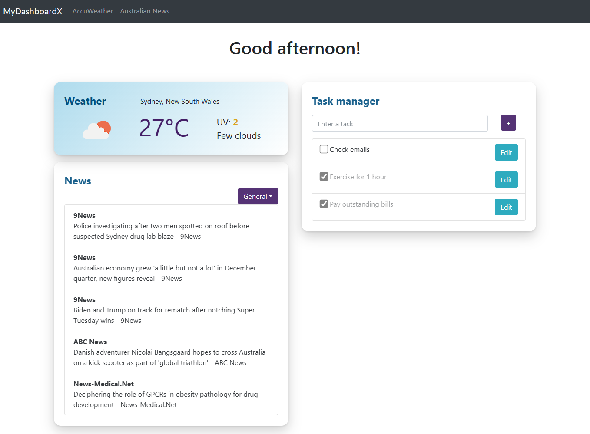

# MyDashboardX - Personal Dashboard

## Overview
_MyDashboardX_ is a personal dashboard application that provides users with a variety of data and features to stay informed. Users can track local weather updates, access news from various categories, and use the task manager to stay organized.

## Usage
To get started with running MyDashboardX locally, follow these steps:
1. Ensure [Node.js](https://nodejs.org/en) is installed and configured in your device.
2. Clone the repository to your local device from GitHub.
3. In your terminal, install the necessary dependencies using `npm install`.
4. Start the server using `npm start`.
5. Access the application in your web browser at http://localhost:3000.

## Technologies used
- [React.js](https://react.dev/): a front-end JavaScript library for reusable UI components and state management.
- [Node.js](https://nodejs.org/en): a back-end JavaScript runtime environment for installing and running npm packages.
- [OpenWeather API](https://openweathermap.org/) & [News API](https://newsapi.org/): open-source APIs that provide real-time weather and news updates.
- [React-Bootstrap](https://react-bootstrap.netlify.app/): a front-end framework that provides pre-designed components, which helped me build the front-end interface more efficiently. These components are also compatible with responsive design.
- [Lodash](https://lodash.com/): a popular and well-tested utility library. I mainly used this tool to perform array and object operations with minimal coding, especially when equivalent JavaScript built-in functions are not available.
- [Dotenv](https://www.npmjs.com/package/dotenv): used to save the API keys in a separate .env file instead of hardcoding them in the script files for security and easier management.
- [LocalStorage](https://developer.mozilla.org/en-US/docs/Web/API/Window/localStorage): used to store the task data in the local browser.

## Screenshot
